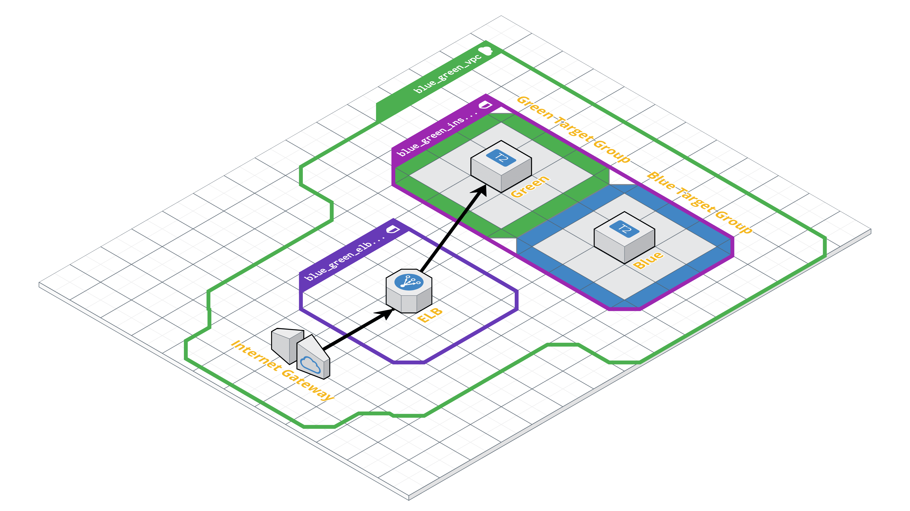

# Blue/Green deploys using AWS Elastic Load Balancer

This is a simple Terraform provision script that creates some AWS infrastructure
consisting primarily of Elastic Load Balancer and a couple EC2 instances. This
is a proof of concept for using ELB as a way to do [blue/green deployments](https://martinfowler.com/bliki/BlueGreenDeployment.html).

_[Read more about how this approach solves the blue/green deployment problem.](#specifics)_

The Terraform plan should define infrastructure that looks like this:

[](https://cloudcraft.co/view/1c585bca-0562-4b11-8281-bd948044fd92?key=cQrA7McsgrYL_ajeG7SjUw)

**PLEASE NOTE:** Running Terraform will provision real resources in your AWS
account, and may incur costs to you as the account holder.

**DO NOT RUN THIS IN A SHARED AWS ACCOUNT OR ENVIRONMENT.** It provides no
protections against corrupting or otherwise damaging existing infrastructure. 

## Dependencies

In order to install and interact with this provisioning script, you'll need the
following dependencies installed:

- [Terraform](https://www.terraform.io/downloads.html)
- [The AWS CLI tool](https://docs.aws.amazon.com/cli/latest/userguide/installing.html)
- [Ansible](https://docs.ansible.com/ansible/latest/installation_guide/intro_installation.html)
- [jq](https://stedolan.github.io/jq/)
- `ansible-galaxy install rvm.ruby`

## Getting Started

<ol>
<li>Make sure you have an RSA public/private keypair for SSH living at
<code>~/.ssh/mongeese-footprints</code> (private), and <code>~/.ssh/mongeese-footprints.pub</code> (public).
This keypair will be used by Ansible to provision the hosts.</li>
<li>Set your AWS credentials in your environment, so that Terraform can make API calls to AWS on your behalf:

```bash
export AWS_ACCESS_KEY_ID=your-access-key-id-here
export AWS_SECRET_ACCESS_KEY=your-secret-access-key-here
```
</li>

<li>Run <code>bin/up</code> to provision the Footprints infrastructure to AWS.</li>
</ol>

## After Provisioning AWS

Once AWS is fully provisioned by Terraform, and Ansible has completed its scripts
to provision the EC2 hosts that will serve the Footprints app, there is one more
process to complete to deploy the application for the first time.

To deploy the Footprints app to the "blue" EC2 instance (meaning staging), update the `.cap_env`
file to point to the IP address for the target EC2:

```bash
cd /path/to/footprints-public

# Load the `.cap_env` file's contents into your bash session's memory
source .cap_env

# Run the first Capistrano deploy to the "green" EC2 WITH THE MIGRATIONS ENV VAR SET!
RUN_MIGRATIONS=1 cap production deploy
```

Next, switch which instance is "production" by following the below instructions on switching
from green to blue. Rerun the above commands. Then run the switch again.

## Changing from "green" to "blue"

When you visit the URL associated with the AWS Elastic Load Balancer created by
Terraform, you should see that the "green" EC2 instance is receiving traffic.

Now, run the command `bin/switch`. Reload the browser, and you should see that
the page now shows the "blue" EC2 instance is serving its page.

Run `bin/switch` again, and you should see the page go back to "green".

**Note:** It might take a few reloads to see the new content, but it should take
only a few seconds for AWS to start redirecting traffic to the new Target Group
after switching each time.

## Tearing Down When Done

**DANGER ZONE - Make sure you are ready to tear down the Footprints infrastructure before proceeding!**

After you have finished your work, you may destroy any residual Terraform
resources you have created to avoid being billed for them. To do this, run the
provided bash script, which should destroy only the Terraform infrastructure you
provisioned in the `up` script:

```bash
bin/down
``` 

Note that the EC2 instances themselves will be destroyed in the process.

**Note:** If the RDS instance does not want to be destroyed on its own, you might
need to manually delete it using the AWS UI. If you do this, make sure you are
certain it is safe to do so.
